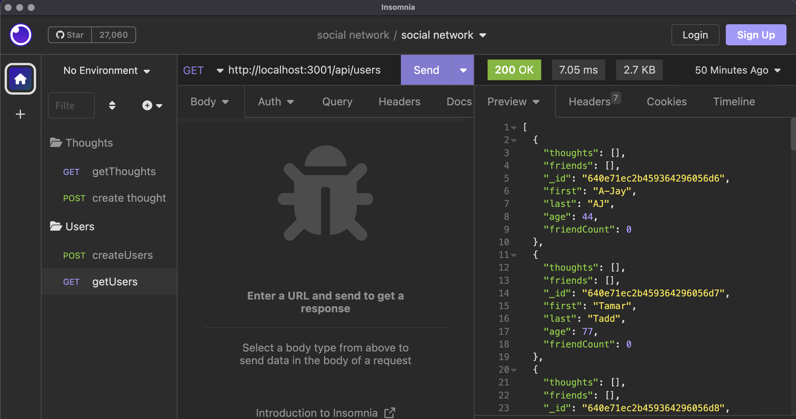

# social-network-api

This is an API for a social network web application where users can share their thoughts, react to friends’ thoughts, and create a friend list.

## Installation

### Prerequisites-local machine

This app uses **Node.js**, **Mongoose**, **MongoDB**, and **Express.js** so you will need to install all of these. In addition, to see the API at work, you will need yo use **Insomnia** or **Postman**.

## Usage

**Project setup**

- Clone down this repository locally
  `git clone git@github.com:westgards/social-network-api.git`
- You will need to install
  - `nvm`
  - `npm`
  - `express.js`
  - `mongoose`

\*_Use the command to run the app_
`node server.js` then navigate to localhost:3001

\*\*This app is not deployed, you can see the api in action with Insomina below in the demo video:

[social network api video link]()

## Credits

Tutorials:

- [U of MN Coding Bootcamp Link](https://github.com/coding-boot-camp)
